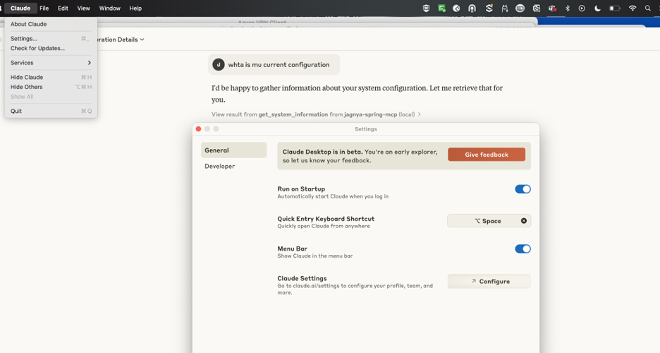

# 🔌 MCP Server Integration with Claude Desktop (Anthropic)

This project demonstrates how to build a custom MCP Server using **Spring Boot + Spring AI**, and integrate it with **Claude Desktop** (by Anthropic) to fetch system details like Java version.

---

## 📦 Prerequisites

- Java 21+
- Maven
- Claude Desktop (download from [Anthropic](https://www.anthropic.com))
- Spring Boot (compatible version)

---

## 🧰 Getting Started

### 1. 🛠️ Build the MCP Server

Clone this repo and run the following command to package the Spring Boot MCP server:


mvn clean package


###  2. Test Locally (Optional)

To test your MCP server locally:

java -jar target/spring-mcp-0.0.1-SNAPSHOT.jar

You should see the server running and waiting for incoming MCP requests.

###  2.  Test Locally (Optional)🧩 Integrate with Claude Desktop
Follow the steps below to integrate your MCP server with Claude Desktop:

[Download](https://claude.ai/download) Clude AI Desktop app 

### Start Claude Desktop after installation:


## ⚙️ Step 2: Configure MCP Server in Claude

Open the Claude Desktop settings 


### Then navigate to the Developer section, then click on Edit Config and Locate and edit the claude_desktop_config.json file and add the MCP Server configuration:


### 🛠 Claude Desktop MCP Configuration

To connect Claude Desktop to your local Spring MCP Server, update your `claude_desktop_config.json` file as shown below:

```bash
{
  "mcpServers": {
    "jagnya-spring-mcp": {
      "command": "/Users/jagnyapanigrahi/Library/Java/JavaVirtualMachines/sapmachine-21.0.6/Contents/Home/bin/java",
      "args": [
        "-jar",
        "/Users/pathto/target/spring-mcp-0.0.1-SNAPSHOT.jar"
      ]
    }
  }
}
```

### Restart Claude Desktop.

If everything is configured correctly, you should see the hammer 🛠️ and plugin 🔌 icons in the sidebar.


### Check the icon, and it will list all the function/tool registers from the  server 


### Ask any system-related question like " Hi get my system details with which java version installed "

 

